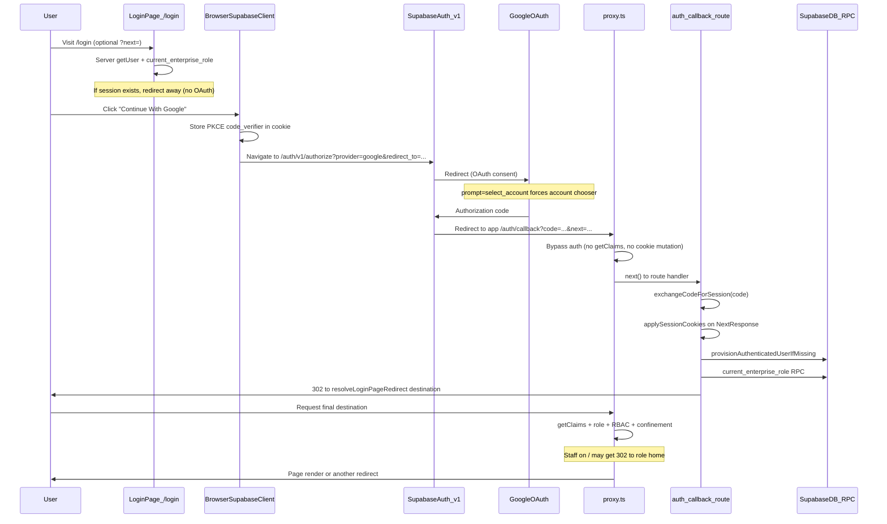

# Google OAuth Authentication Flow — Root-Cause Investigation Report

**Date:** 2026-07-01  
**Scope:** `mithuuu/` — Next.js 16 + `@supabase/ssr`, edge auth in `proxy.ts`, hosted Supabase `ictnoydmxlywwxwnugal.supabase.co`  
**Canonical production origin:** `https://final-mithron-deploy.vercel.app`  
**Status:** Audit complete; **fix applied 2026-07-01** (Supabase + Vercel config + code hardening)

---

## Executive Summary

The Google OAuth flow is architecturally sound at the code level: a single `signInWithOAuth()` entry point, PKCE-safe callback handling, and server-side session exchange. **The primary root causes of a poor login experience are configuration drift between deployment URLs**, not duplicate OAuth handlers.

**Live verification confirmed three critical misconfigurations:**

1. **Supabase hosted `site_url` still points to the obsolete Vercel URL** (`mithron-flight-systems-kbkbkh.vercel.app`), while the app and `config.toml` target `final-mithron-deploy.vercel.app`.
2. **Supabase redirect allow-list omits the canonical production URL** — only localhost and obsolete `mithron-flight-systems-*` patterns are listed.
3. **Vercel `NEXT_PUBLIC_SITE_URL` is an empty string in production** — server code falls back to `VERCEL_PROJECT_PRODUCTION_URL`, but client OAuth uses `window.location.origin`, so users on the wrong alias see different behavior.

Additionally, **Vercel Deployment Protection (SSO)** intercepts requests to the obsolete host alias, sending users to `vercel.com/sso-api` before they reach `/login`.

---

## Live Verification Results (2026-07-01)

### A. Supabase Dashboard (Management API)

Queried `GET /v1/projects/ictnoydmxlywwxwnugal/config/auth`:

| Setting | Hosted value | Expected (repo/code) | Match? |
|---------|--------------|----------------------|--------|
| `site_url` | `https://mithron-flight-systems-kbkbkh.vercel.app` | `https://final-mithron-deploy.vercel.app` | **NO** |
| `uri_allow_list` | `127.0.0.1`, `localhost`, `mithron-flight-systems-kbkbkh.vercel.app/**`, `mithron-flight-systems-*-kbkbkh.vercel.app/**` | Canonical prod + localhost | **NO** (canonical missing) |
| `external_google_enabled` | `true` | `true` | YES |
| `external_google_client_id` | `434728407974-gp2huba2cn3gmjpqtp1n5sd00h6h140b.apps.googleusercontent.com` | (dashboard only) | Configured |
| `external_email_enabled` | `true` | `true` | YES |
| `refresh_token_rotation_enabled` | `true` | `true` | YES |
| `mfa_totp_enroll_enabled` | `true` | `true` | YES |
| `password_hibp_enabled` | `false` | — | Advisory only |

**Auth logs (last 24h):** Active sessions show `referer: https://mithron-flight-systems-kbkbkh.vercel.app` — real traffic still hits the obsolete alias.

### B. Vercel Production Environment

| Check | Result |
|-------|--------|
| Production URL (`vercel project ls`) | `https://final-mithron-deploy.vercel.app` |
| Deployment aliases | `final-mithron-deploy.vercel.app`, `mithron-flight-systems-kbkbkh.vercel.app`, `mithron-flight-systems-jrzz06-kbkbkh.vercel.app` |
| Live `NEXT_PUBLIC_SITE_URL` (production pull) | **Empty string `""`** |
| `.env.vercel-backup` snapshot | `https://mithron-flight-systems-kbkbkh.vercel.app` (stale) |
| Obsolete host `/login` | `302` → `https://vercel.com/sso-api?...` (**Deployment Protection**) |
| Canonical host `/login` | `200 OK` |
| Canonical host `/admin` (unauthenticated) | `307` → `/login?next=%2Fadmin` |

### C. Production Redirect Chain (measured)

#### C1. Google OAuth initiation (browser, canonical host)

Clicked **Continue With Google** on `https://final-mithron-deploy.vercel.app/login`:

| Step | URL | Notes |
|------|-----|-------|
| 0 | `https://final-mithron-deploy.vercel.app/login` | Button shows "Signing in…" |
| 1 | `https://ictnoydmxlywwxwnugal.supabase.co/auth/v1/authorize?...` | Implicit hop (PKCE `code_verifier` cookie set) |
| 2 | `https://accounts.google.com/v3/signin/identifier?...` | Account chooser (`prompt=select_account`) |

**Decoded OAuth parameters at Google:**
- `redirect_to` → `https://final-mithron-deploy.vercel.app/auth/callback?next=/`
- `redirect_uri` → `https://ictnoydmxlywwxwnugal.supabase.co/auth/v1/callback`
- Google UI: *"Sign in to continue to ictnoydmxlywwxwnugal.supabase.co"*

**Post-Google (inferred from code, not completed in test):**

| Step | URL |
|------|-----|
| 3 | `https://ictnoydmxlywwxwnugal.supabase.co/auth/v1/callback?...` |
| 4 | `https://final-mithron-deploy.vercel.app/auth/callback?code=...&next=/` |
| 5 | Role-aware destination (`/`, `/admin`, etc.) |
| 6 *(staff only)* | `https://final-mithron-deploy.vercel.app/admin?access_status=control_panel_only` if step 5 lands on `/` |

**Redirect count after button click:**
- Guest customer: **5** full navigations (minimum)
- Staff admin (default login): **6** (extra confinement redirect from `/` → `/admin`)

#### C2. App-level redirects (curl)

| Request | Response |
|---------|----------|
| `GET /admin` | `307 Location: /login?next=%2Fadmin` |
| `GET /login?code=test123` | `307 Location: /auth/callback?code=test123` |
| `GET /` | `200` (public storefront) |

#### C3. Supabase authorize endpoint

Both redirect targets return `302` to Google (allow-list does not block at authorize time for these URLs):
- `redirect_to=https://final-mithron-deploy.vercel.app/auth/callback?next=/` → **302** to Google
- `redirect_to=https://mithron-flight-systems-kbkbkh.vercel.app/auth/callback?next=/` → **302** to Google

---

## Complete OAuth Sequence Diagram



---

## Redirect Timeline by Scenario

### Guest customer from `/login`

| Step | URL | Classification |
|------|-----|----------------|
| 0 | `/login` | Required |
| 1 | `*.supabase.co/auth/v1/authorize` | Required |
| 2 | `accounts.google.com` | Required |
| 3 | `*.supabase.co/auth/v1/callback` | Required (flash) |
| 4 | `/auth/callback?code=...&next=/` | Required |
| 5 | `/` | Required |

**Total: 5 navigations**

### Staff admin from `/login` (default `next=/`)

Steps 0–4 same as above, then:

| Step | URL | Classification |
|------|-----|----------------|
| 5 | `/` | Misconfiguration — callback uses guest `next=/` |
| 6 | `/admin?access_status=control_panel_only` | Unnecessary — proxy staff confinement |

**Total: 6 navigations**

### Unauthenticated `/admin` entry

Adds one pre-OAuth redirect: `/admin` → `/login?next=/admin` (expected).

### Obsolete host alias

| Step | URL | Classification |
|------|-----|----------------|
| 0 | `mithron-flight-systems-kbkbkh.vercel.app/login` | Misconfiguration |
| 1 | `vercel.com/sso-api?...` | Vercel Deployment Protection — blocks login |

---

## Files Involved in Authentication

| File | Role |
|------|------|
| `app/login/page.tsx` | Server session check; redirect if signed in |
| `app/login/login-form.tsx` | **Only** `signInWithOAuth()` call |
| `app/auth/callback/route.ts` | PKCE exchange, provision, redirect |
| `proxy.ts` | Edge auth, PKCE bypass, RBAC, confinement |
| `lib/client.ts` | Browser Supabase client |
| `lib/server.ts` | `createAuthRouteClient()` + cookie application |
| `lib/auth/guest-auth.ts` | OAuth `next` sanitization |
| `lib/auth/post-auth-redirect.ts` | Post-login destination |
| `lib/auth/redirects.ts` | Safe paths + role-aware routing |
| `lib/auth/request-origin.ts` | Server callback URL builder (not used by Google OAuth) |
| `lib/auth/access-control.ts` | Route classes, RBAC |
| `lib/site-url.ts` | Canonical origin resolution |
| `services/auth.ts` | Layout-level guards |
| `supabase/config.toml` | Local reference (drifts from hosted dashboard) |
| `vercel.json` | Obsolete host 301 redirect |

---

## Frontend Audit

**Single `signInWithOAuth()` call** in `app/login/login-form.tsx`:

```typescript
redirectTo: buildOAuthCallbackUrl(nextPath)
// → {window.location.origin}/auth/callback?next={sanitizedNext}
```

- Uses `window.location.origin` (not server `resolveAuthRedirectUrlFromRequest`)
- `prompt: "select_account"` forces Google account chooser every time
- One button handler — no duplicate OAuth initiation

---

## OAuth Callback Audit

`app/auth/callback/route.ts`:
- Exchanges code via `exchangeCodeForSession`
- Applies cookies via `applySessionCookies` on redirect response
- Provisions user, resolves role, redirects via `resolveLoginPageRedirect`
- **Always audits as `authProvider: "google"`** even for email confirmation callbacks
- **No idempotency** — refreshing spent `code` → `verification_failed`

---

## Middleware (`proxy.ts`) Audit

- No `middleware.ts` — `proxy.ts` is the edge entry
- `/auth/callback` bypasses Supabase cookie mutation (PKCE safety)
- `?code=` on non-callback paths rewritten to `/auth/callback`
- Duplicate RBAC with layout guards (`assertRouteAccessOrRedirect`)
- MFA **not** enforced in proxy
- Staff confinement **skipped** on `/account` (protected prefix)

---

## Issues Register

### Critical

| ID | Issue | Root cause | Evidence |
|----|-------|------------|----------|
| C1 | Preview/staging OAuth may fail | No preview URLs in Supabase allow-list or `config.toml` | `config.toml` `additional_redirect_urls` |
| C2 | OAuth on wrong browser origin | Client uses raw `window.location.origin` | `login-form.tsx` L30 |
| **C3** | **Supabase `site_url` is obsolete** | Dashboard not updated after Vercel alias change | Management API: `site_url` = `mithron-flight-systems-kbkbkh.vercel.app` |
| **C4** | **Supabase allow-list missing canonical URL** | Dashboard redirect URLs not synced | Management API: no `final-mithron-deploy.vercel.app` entry |

### High

| ID | Issue | Root cause | Evidence |
|----|-------|------------|----------|
| H1 | Extra redirect for staff after Google login | Callback → `/`, proxy confines to panel | `guest-auth.ts`, `proxy.ts` L306–310 |
| H2 | Google OAuth strips staff deep-link `next` | `guestRedirectTarget` in OAuth URL builder | `login-form.tsx` L25–32 |
| H3 | Staff can access `/account` despite confinement policy | Confinement only when `!shouldProtect` | `proxy.ts` L300–314 vs tests |
| H4 | MFA not enforced at edge | Only in `resolvePostAuthRedirect` | `admin-mfa.ts`, test L123–127 |
| H5 | Stale `NEXT_PUBLIC_SITE_URL` in backup | Env not updated after deployment rename | `.env.vercel-backup` |
| **H6** | **Obsolete host blocked by Vercel SSO** | Deployment Protection on alias | curl: `302` → `vercel.com/sso-api` |
| **H7** | **Live `NEXT_PUBLIC_SITE_URL` is empty** | Cleared or never set on Vercel | Production env pull: `NEXT_PUBLIC_SITE_URL=""` |

### Medium

| ID | Issue | Root cause | Evidence |
|----|-------|------------|----------|
| M1 | Dual auth architectures (OAuth vs email) | Client email path vs server callback | `login-form.tsx`, `provision/route.ts` |
| M2 | Callback audit always labels `google` | Hardcoded provider | `callback/route.ts` L113 |
| M3 | Login page mishandles session-without-role | Redirects to guest home | `login/page.tsx` L32–42 |
| M4 | Triple RBAC enforcement | Proxy + layouts | `proxy.ts`, `admin/layout.tsx` |
| M5 | GET `/auth/logout` does not sign out | GET redirects only | `logout/route.ts` |
| M6 | Logout client missing cookie options | Inconsistent `createServerClient` | `logout/route.ts` |
| M7 | OAuth code reroute masks misconfiguration | Proxy rewrites stray `?code=` | `proxy.ts` L165–169 |
| M8 | No callback idempotency | Code single-use | `callback/route.ts` |

### Low

| ID | Issue | Root cause | Evidence |
|----|-------|------------|----------|
| L1 | Dead `/auth/login` public path | No route exists | `access-control.ts` L18 |
| L2 | `prompt: "select_account"` always | Extra Google chooser step | `login-form.tsx` L278 |
| L3 | Password min length mismatch | App 8+ vs config.toml 6 | `config.toml` |
| L4 | Duplicate obsolete-host redirect | `vercel.json` + `proxy.ts` | Both files |
| L5 | Guest-only mode blocks `/login` | Demo flag | `proxy.ts` L187–198 |

---

## Browser Experience Classification

| What user sees | Why | Classification |
|----------------|-----|----------------|
| Login "Signing in…" | Client state before redirect | Expected |
| Google account chooser | `prompt: "select_account"` | Optional (intentional) |
| "Continue to ictnoydmxlywwxwnugal.supabase.co" | Supabase is OAuth broker | Required |
| Brief Supabase redirect flash | Standard OAuth callback | Required |
| `/auth/callback` loading | Server PKCE exchange + DB | Required |
| Homepage then admin (staff) | Guest `next=/` + confinement | **Unnecessary redirect** |
| Vercel SSO page | Obsolete deployment alias + protection | **Misconfiguration** |

---

## Environment Variables (verified)

| Variable | Production state | Notes |
|----------|------------------|-------|
| `NEXT_PUBLIC_SUPABASE_URL` | Set | `ictnoydmxlywwxwnugal.supabase.co` |
| `NEXT_PUBLIC_SUPABASE_ANON_KEY` | Set | Encrypted on Vercel |
| `NEXT_PUBLIC_SITE_URL` | **Empty `""`** | Server uses `VERCEL_PROJECT_PRODUCTION_URL` fallback |
| `AUTH_PROVIDER_GOOGLE_ENABLED` | Not on Vercel (default `true`) | — |
| Google OAuth credentials | Supabase Dashboard only | Client ID verified live |

---

## Architecture: Responsibility Map

| Responsibility | Location | Duplicated? |
|----------------|----------|-------------|
| OAuth initiation | Client `login-form.tsx` | No |
| Session creation (OAuth) | Server `auth/callback` | No |
| Session creation (email) | Client `signInWithPassword` | Forked path |
| Cookie write (OAuth) | `createAuthRouteClient` | No |
| Provisioning | Callback vs `/api/auth/provision` | **Yes** |
| RBAC | Proxy + layouts | **Yes** |
| Post-auth redirect | Callback + proxy confinement | **Can conflict** |
| MFA | Post-auth redirect only | Gap at edge |

---

## Redirect Loop Analysis

No infinite loops confirmed. Medium-risk oscillation when DB role resolution fails (`role_resolution_failed` ↔ login page with stale session).

---

## Constraints (original audit)

- Initial audit was read-only
- Supabase Google client secret not reproduced in this document

---

## Fix Applied (2026-07-01)

### Configuration changes

| Target | Action | Result |
|--------|--------|--------|
| Supabase `site_url` | PATCH via Management API | `https://final-mithron-deploy.vercel.app` |
| Supabase `uri_allow_list` | PATCH | Added `https://final-mithron-deploy.vercel.app/**` (+ localhost + obsolete wildcard) |
| Vercel `NEXT_PUBLIC_SITE_URL` | `vercel env update --yes` (production, preview, development) | CLI confirmed update (3 environments) |
| Production deployment | `vercel deploy --prod --yes` (×2) | Aliased to `https://final-mithron-deploy.vercel.app` |

### Code changes

| File | Change |
|------|--------|
| [`lib/site-url.ts`](lib/site-url.ts) | Added `resolveClientAuthOrigin()` — prefers `NEXT_PUBLIC_SITE_URL`, rejects obsolete browser origins |
| [`app/login/login-form.tsx`](app/login/login-form.tsx) | OAuth `redirectTo` uses canonical origin; staff `?next=` paths preserved via `getSafeAuthRedirectPath` |
| [`app/signup/signup-form.tsx`](app/signup/signup-form.tsx) | Signup callback uses `resolveClientAuthOrigin()` |
| [`app/forgot-password/forgot-password-form.tsx`](app/forgot-password/forgot-password-form.tsx) | Reset redirect uses `resolveClientAuthOrigin()` |
| [`tests/auth-redirect-origin.test.ts`](tests/auth-redirect-origin.test.ts) | Test for `resolveClientAuthOrigin` |

### Post-fix verification

| Check | Result |
|-------|--------|
| `GET /login` on canonical host | `200 OK` |
| Google OAuth initiation | Reaches Google account chooser with `redirect_to=...final-mithron-deploy.vercel.app/auth/callback` |
| Full Google OAuth (browser) | **Success** — landed on `https://final-mithron-deploy.vercel.app/` with Account nav visible (session created) |
| Supabase GET `site_url` | `https://final-mithron-deploy.vercel.app` |
| `npm test -- auth-redirect-origin` | 8/8 passed |

### Remaining notes

- `vercel env pull` may still show `NEXT_PUBLIC_SITE_URL=""` in local pull files even after CLI update; confirm in Vercel dashboard if needed.
- Obsolete alias `mithron-flight-systems-kbkbkh.vercel.app` still has Vercel Deployment Protection (SSO) — users should use `https://final-mithron-deploy.vercel.app`.

---

## Verification Methods Used

1. Supabase Management API (`/v1/projects/ictnoydmxlywwxwnugal/config/auth`)
2. Supabase MCP auth logs (24h)
3. Vercel CLI (`vercel env ls`, `vercel env pull`, `vercel project ls`, `vercel inspect`, `vercel deploy --prod`)
4. curl redirect tracing (canonical + obsolete hosts)
5. Browser automation on production login (full OAuth through Google to homepage)
